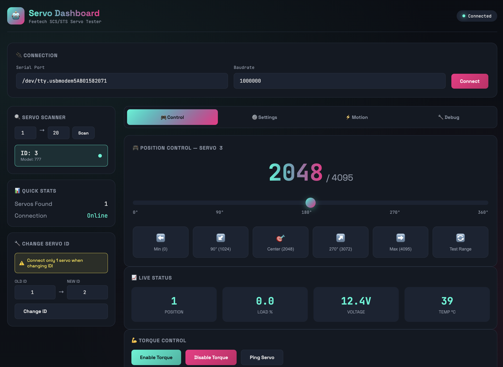
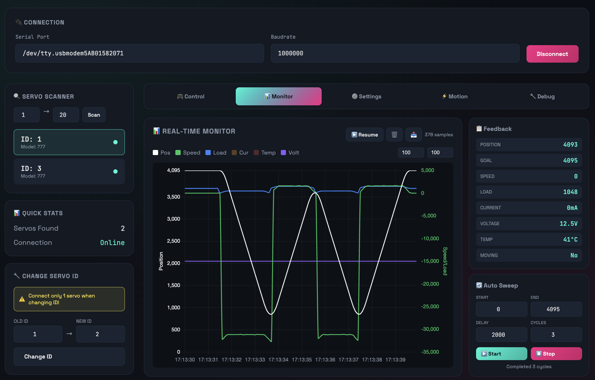
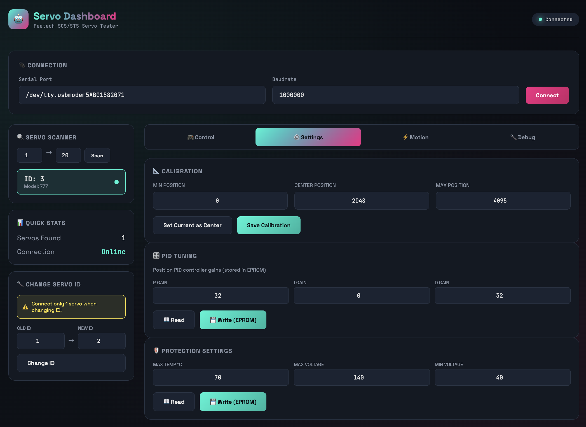
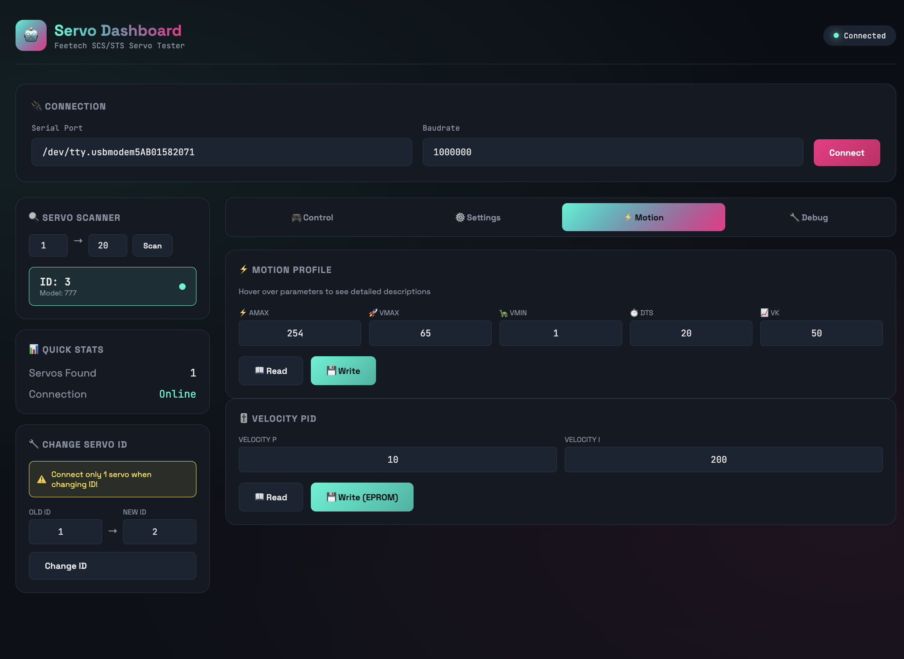
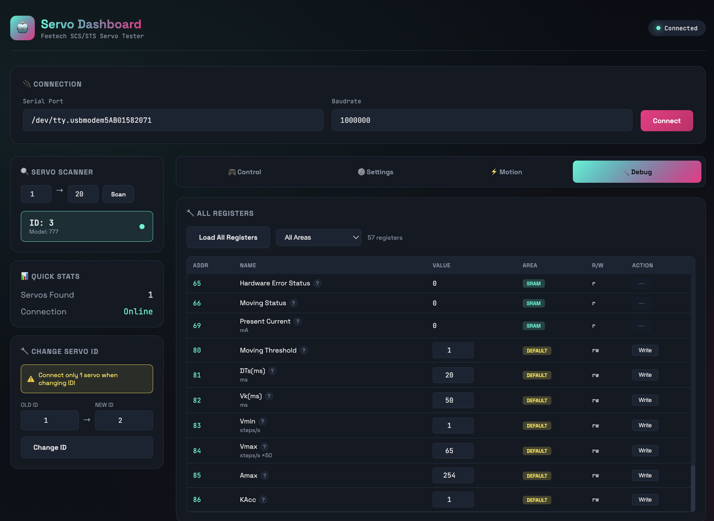

# FT-SCServo-Web-Debug

🤖 Web-based debug & control dashboard for Feetech SCS/STS servos.

Inspired by [FT_SCServo_Debug_Qt](https://github.com/Kotakku/FT_SCServo_Debug_Qt)

## Screenshots

### 🎮 Control Tab
Position control with slider, quick presets, live status monitoring, and torque control.



### 📊 Monitor Tab
Real-time chart with Position, Speed, Load, Current, Temperature, Voltage. Auto Sweep for testing.



### ⚙️ Settings Tab
Calibration, PID tuning, and protection settings.



### ⚡ Motion Tab
Motion profile parameters (Amax, Vmax, Vmin, DTs, Vk) and velocity PID.



### 🔧 Debug Tab
Full register table with 50+ registers, filterable by area (EPROM/SRAM/DEFAULT).



## Features

- 🔍 **Servo Scanner** - Auto-detect all connected servos (ID 1-253)
- 🎮 **Position Control** - Intuitive slider + quick presets (0°, 90°, 180°, 270°, 360°)
- 📊 **Real-time Chart** - Live graph of Position, Speed, Load, Current, Temp, Voltage
- 🔄 **Auto Sweep** - Automatic sweep between Start/End positions for testing
- 📥 **Data Export** - Export recorded data to CSV file
- 🔧 **Change Servo ID** - Modify servo ID (stored in EEPROM)
- 💪 **Torque Control** - Enable/disable servo torque
- ⚙️ **Calibration** - Set min/max/center positions
- 🎛️ **PID Tuning** - Position P/I/D gains, Velocity P/I gains
- 🛡️ **Protection Settings** - Max/Min voltage, Max temperature limits
- ⚡ **Motion Profile** - Amax, Vmax, Vmin, DTs, Vk parameters
- 📋 **Debug Register Table** - View/edit all 50+ servo registers
- 💾 **LocalStorage Cache** - Port settings persist across page reloads

## Quick Start

```bash
# Create virtual environment
python -m venv venv
source venv/bin/activate  # Linux/Mac
# or: venv\Scripts\activate  # Windows

# Install dependencies
pip install -r requirements.txt

# Run the server
python main.py
```

Then open http://localhost:8081 in your browser.

## Hardware

- Feetech SCS/STS series servos (e.g., STS3215, SCS0009, etc.)
- USB to TTL adapter (e.g., Waveshare Bus Servo Adapter)

## API Endpoints

| Endpoint | Method | Description |
|----------|--------|-------------|
| `/api/connect` | POST | Connect to serial port |
| `/api/disconnect` | POST | Disconnect |
| `/api/scan` | POST | Scan for servos |
| `/api/servos` | GET | List all servos |
| `/api/servo/{id}/status` | GET | Get servo status |
| `/api/servo/{id}/registers` | GET | Read all registers |
| `/api/servo/position` | POST | Set position |
| `/api/servo/torque` | POST | Set torque |
| `/api/servo/change-id` | POST | Change servo ID |
| `/api/servo/register` | POST | Write single register |
| `/api/servo/motion-params` | POST | Set motion parameters |
| `/ws` | WebSocket | Real-time status updates |

## Register Areas

| Area | Description | Persistence |
|------|-------------|-------------|
| **EPROM** | Configuration registers | Persistent (survives power cycle) |
| **SRAM** | Runtime registers | Volatile (reset on power cycle) |
| **DEFAULT** | Motion profile params | Persistent |

## TODO

- [ ] Save/Load servo configurations to file
- [ ] Multi-servo group control
- [ ] Trajectory recording & playback
- [ ] Servo firmware upgrade
- [ ] PWM mode support

## License

MIT
